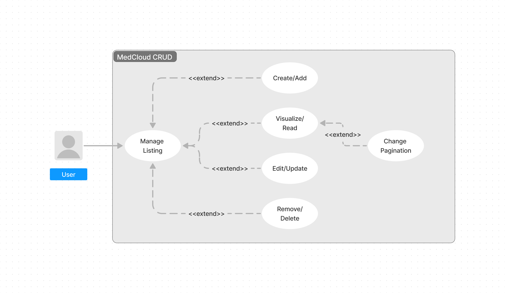
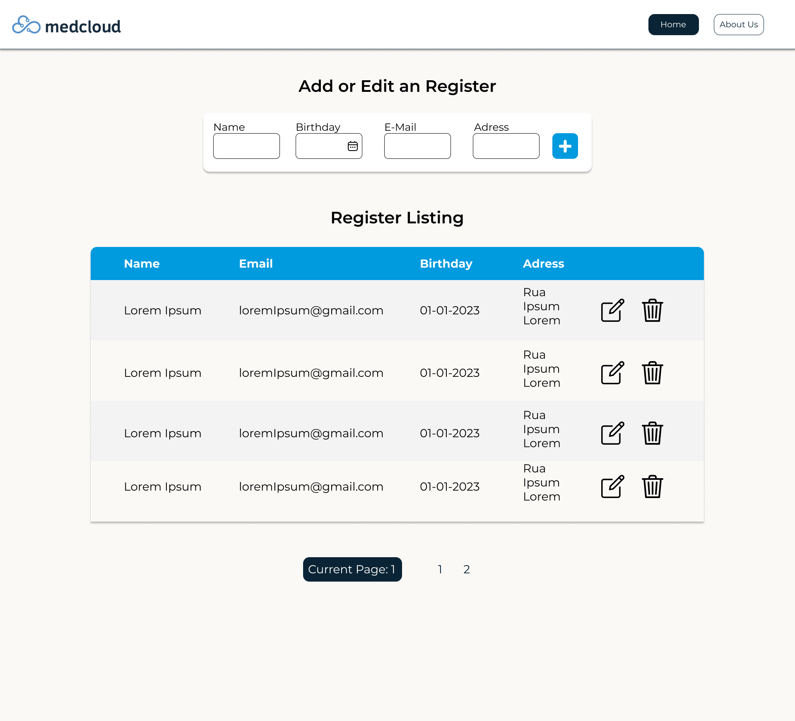

# Medcloud Test 

This project has an education/professional intent, all the requirements were liested by [Medcloud](https://medcloud.link/).

# Before Launching 

Make sure that the SQL script, colcated in ./assets is downloaded and used on your machine, also check if the command line is runnig. This can make the web application unable to use.

`ALTER USER 'root'@'localhost' IDENTIFIED WITH mysql_native_password BY 'YOUR_PASSWORD'`

## Available Scripts 

In the project directory, you should/can run:

### `yarn/npm start`

Runs the app in the development mode.
Open [http://localhost:3000](http://localhost:3000) to view it in your browser.

The page will reload when you make changes.\
You may also see any lint errors in the console.

### `npm install`

Download all the packges that are ignored on the file `.gitgnore`. This one is a must do.

## Prototipation

All prototypes were made using [Figma](https://www.figma.com/).

### Use Case

### Screen

